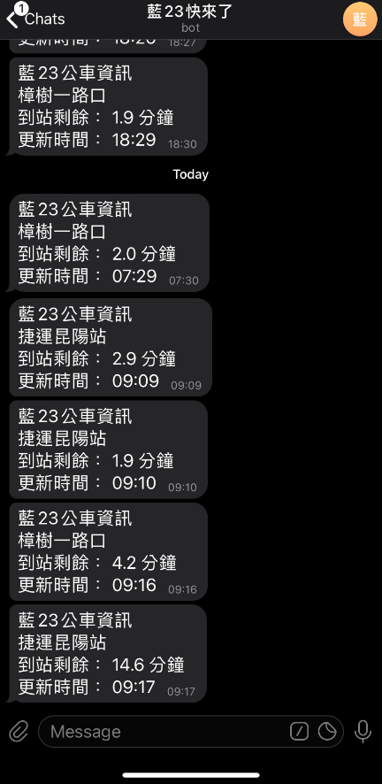

# Bus Notify by Telebot
## Environment
- python3.6
- [pyTelegramBotAPI](https://github.com/eternnoir/pyTelegramBotAPI)

## Steps
1. Create a bot by @telegram botfather
    should get a token from botfather
2. Check chat_id
    start conversation with @RawDataBot to find
    ```json
    "message": {
        "chat": {
            "id": ......
        }
    }
    ```
3. Write a secret.json
    ```json
    {
        "token": "token_from_botfather",
        "chat_id": 12345678  // chat_id
    }
    ```
4. Setup crontab
    ```bash
    crontab -e
    ```
    do the query at 17:30 to 17:59 every 3 mins at workday (Mon-Fri)
    ```bash
    30-59/3 17 * * 1-5 cd path/to/your_repo && venv/bin/python main.py > /tmp/cronlog.txt 2>&1
    # exit by :wq
    ```

## Demo
